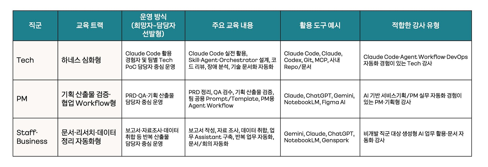
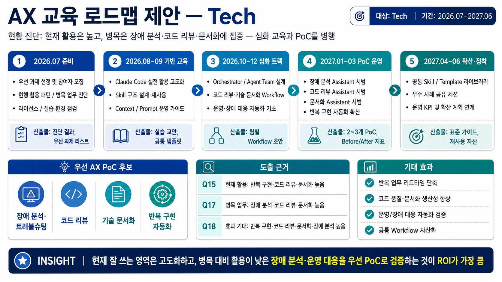
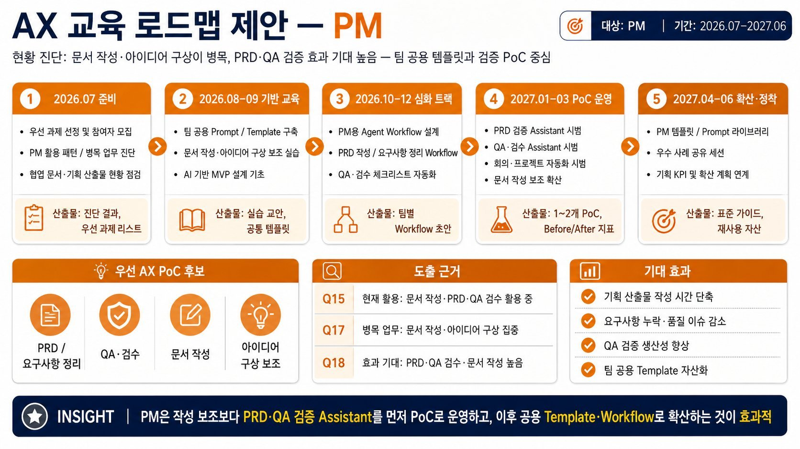
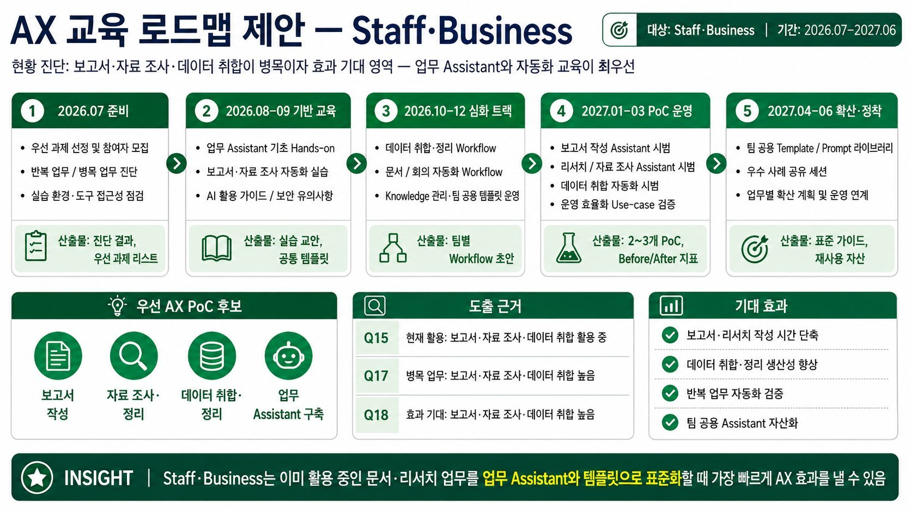
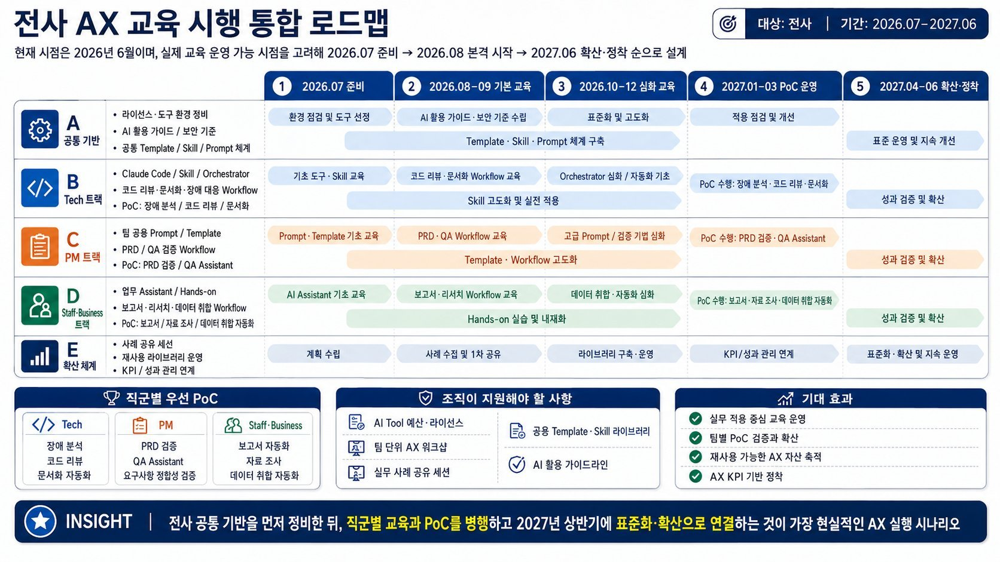

# 경영지원실 AXS 추진 전략 — 9월 22일 실장 보고 본문 검토안

작성 기준: 사용자 제공 9/11 아웃라인, 이후 추진 방향 설명, 9/21 조회한 경영부문 AX 요청사항 시트. 아래의 업무 설계·착수 순서·커뮤니케이션 일정은 검토를 위한 제안이다. 팀별 협의 결과, 실제 연동 가능 여부와 실행 성과는 추가 확인 후 반영한다.

## 1. 이번 보고에서 제안하는 변화

9월 11일 공유한 AXS의 목적은 AI를 업무 전반에 활용해 일하는 방식을 개선하고, 사용자에게 전달하는 가치를 높이는 것이다. Business Loop는 이 목적을 실현하기 위한 운영 방식이다. 업무에서 발생한 신호를 읽고, 기준에 따라 판단하고, 실행 결과를 확인한 뒤 다음 업무에 그 경험을 반영하는 흐름을 만든다.

이번에는 이 방향을 실제 업무 설계로 구체화한다. 에이전트가 담당자와 같은 업무 자료를 보고, 같은 규칙으로 처리 계획을 만들며, 허용된 도구를 통해 작업하고, 결과를 원장에 남길 수 있도록 업무 환경을 구성한다. 이를 ‘업무 아키텍처’로 정의한다. 핵심 산출물은 업무별로 무엇을 읽고, 무엇을 판단하며, 어디에 실행하고, 누가 확인하는지를 연결한 실행 가능한 업무 명세다.

우선 각 팀의 요청 과제를 다시 확인해 반복 업무 한 구간을 선정한다. 해당 구간의 업무 기준과 데이터 상태를 명확히 한 뒤, 작은 범위에서 실제 결과와 비교한다. 확대 여부는 처리 시간뿐 아니라 오류·누락, 담당자 검토 부담과 사용자 체감으로 판단한다.

## 2. 업무 아키텍처에 담을 내용

| 설계 대상 | 구체적으로 정할 내용 | 착수 전에 확보할 결과물 |
|---|---|---|
| 업무 형상 | 시작 신호, 처리 대상, 상태 변화, 판단 규칙, 예외, 결과물, 완료 조건 | 실제 사례 1건을 처음부터 끝까지 설명한 업무 명세 |
| 업무 표면 | 담당자가 요청을 받고 자료를 확인하며 결과를 전달하는 시스템과 화면 | 에이전트의 입력·작업·결과 확인 위치를 표시한 흐름도 |
| 데이터 | 항목별 정본, 소유자, 갱신 시점, 필요한 최신성, 값이 충돌할 때의 우선순위 | SSOT 목록과 갱신·검증 규칙 |
| 도구와 API | 필요한 조회·변경 기능, 인증 주체, 허용 범위, 호출 결과와 오류 처리 | 연결 대상별 기능·권한·시험 결과표 |
| 실행과 학습 | 사람의 승인점, 실행 후 재조회, 중복 처리 방지, 예외 전달, 원장 기록 | 실행 기록과 완료·중단 판정 기준 |

‘업무 표면’은 담당자가 이미 일하는 장소다. 예를 들어 Sheet에서 대상자를 확인하고 메신저로 안내하는 업무라면, 에이전트가 읽을 범위와 안내 초안을 남길 위치, 담당자가 승인할 방법, 발송 결과를 확인할 위치를 연결한다. 실제 시스템은 과제별로 확인해 선택한다. Google·GAM·Claude Admin은 9/11 아웃라인에서 제시한 연결 대상 예시이며, 모든 과제의 필수 구성요소는 아니다.

데이터 구축은 먼저 판단에 필요한 항목을 좁히는 것에서 시작한다. 같은 직원이라도 재직 여부, 정산 여부, 연락처의 정본은 각각 다를 수 있다. 따라서 ‘어느 파일이 정답인가’와 함께 ‘어느 항목의 정답인가’를 지정한다. 처리 시점에는 원천의 기준일과 마지막 갱신 시각을 확인하고, 현업이 정한 최신성 기준을 넘긴 값이나 서로 충돌하는 값은 확인 대상으로 돌린다. 기준을 충족한 데이터로만 처리 계획을 만든다.

## 3. 실제 업무 예시: 웰포인트 미정산 안내

아래는 총무파트 요청을 바탕으로 작성한 설계 예시다. 마감일, 정산 상태 정의, 대상 시스템과 발송 채널은 총무파트 확인이 필요하다.

1. **시작**: 정산 마감 기준일이 도래하면 해당 기간의 미정산 후보 내역을 읽는다. 원천 데이터의 기준 시각과 추출 범위를 함께 기록한다.
2. **확인**: 직원 식별자, 정산 대상 기간, 정산 상태와 안내 대상 연락처를 연결한다. 최신 반영 여부나 식별자가 불명확한 항목은 예외 목록으로 분리한다.
3. **판단**: 현업이 정한 마감·제외·재안내 규칙으로 대상자와 안내 이유를 산출한다. 대상자별로 어떤 원천 값과 규칙을 적용했는지 확인할 수 있게 한다.
4. **승인**: 에이전트가 대상 목록과 안내 문안을 작성하고, 담당자가 제외·보완 사항을 검토한 뒤 발송 범위를 승인한다.
5. **실행**: 초기 검증에서는 승인 전 초안 생성까지 수행한다. 발송 기능을 연결하는 단계에서는 승인 후 정산 상태가 바뀌었는지 다시 확인하고, 승인 범위 안에서 발송한다.
6. **검증**: ‘발송 요청 성공’과 ‘전달 확인’을 구분해 기록한다. 결과를 확인할 수 없는 건은 재시도 여부를 담당자에게 전달하고, 같은 대상·기간·안내 유형의 중복 발송을 막는다.
7. **학습**: 담당자의 수정 사유와 예외 유형을 모아 다음 회차의 업무 규칙을 보완한다. 완료는 단순 초안 생성이 아니라 승인 대상의 처리 결과와 미처리 사유를 모두 설명할 수 있는 상태로 정의한다.

검증 시에는 동일 기간의 현행 수작업 결과와 대상 목록을 대조한다. 목록 작성 시간, 담당자 수정 건수, 대상 누락·불필요한 포함, 중복 안내와 미확인 결과를 측정한다. 허용 기준은 시험 전에 현업이 정하며, 현재 수치나 개선율은 아직 확보되지 않았다.

## 4. 요청 과제를 실행 단위로 재구성

경영부문 AX 요청사항 시트 (내부 원문 링크 비공개)에 기록된 구체 과제는 인사 3건, 총무 2건, 안전보건 5건, 법무 3건, 커뮤니케이션 6건으로 총 19건이다. 인사팀의 ‘중책예산 사용 내역 알람’은 상세 조건이 없어 집계에서 제외했다. 이는 9/21에 읽은 요청 목록이며, 현재 진행 상태는 담당자에게 재확인해야 한다.

| 공통 처리 유형 | 해당 과제 | 함께 검토할 기반 |
|---|---|---|
| 수집·선별·공유 5건 | 안전·법령 이슈, 일·주간 뉴스, 언론사 인사·부고, 자사·경쟁사 뉴스, 정부·공공기관 인사 변동 | 출처·게시 시점, 중복 제거, 관심 주제, 공유 전 검토 |
| 집계·대사·리포트 4건 | 인원 통계·예측, 인건비·초과근무, 웰포인트 과세·공제, 데이터센터 전력량 | 항목 정의, 기준일, 원본 합계와 결과 대사 |
| 상태 확인·누락 안내 5건 | 근태 이상, 웰포인트 미정산, 적격수급인 평가·계약, 외부기관 입·퇴사 명부, 검진 대상·사후관리 | 대상·기한·상태 규칙, 예외, 전달·회신 기록 |
| 전문 판단 지원·콘텐츠 5건 | 검진 코스·병원 추천, 계약 동일성 검증, 계약 조항 스크리닝, 과거 법무 의견 검색, 카드뉴스·쇼츠 | 근거 추적, 원문 비교, 전문가·브랜드 검수 |

이 묶음은 공통 기능을 찾기 위한 설계 제안이다. 동일한 처리 방식이라도 데이터와 접근 권한은 각 업무에 맞춰 운영한다.

원본 기술 검토 의견에는 HR 보고의 GWS Apps Script 활용 가능성, 뉴스 공유의 별도 최종 테스트, 적격수급인 관련 아지트 데이터 접근 제약, 법무 업무의 높은 정확도 요구가 기록돼 있었다. 해당 기록의 작성 시점과 이후 변경 여부는 확인되지 않았다. 기존 구현과 재사용 가능 범위를 담당자에게 먼저 확인한다.

## 5. 초기 검증 범위 제안

| 후보 | 첫 검증에서 만들 결과물 | 필요한 확인 | 다음 단계로 넘어갈 조건 |
|---|---|---|---|
| HR 인원 리포트 | 한 기준일의 인원 집계와 근거 명세 | 재직·조직 정의, 정본, 접근 권한 | 수작업 집계와 차이를 모두 설명하고 담당자가 수용. 예측 기능은 별도 검증 |
| 웰포인트 미정산 안내 | 한 정산 기간의 대상 목록·제외 사유·안내 초안 | 정산 반영 시점, 마감 규칙, 식별자·연락처 | 대상 대사와 담당자 수정 이력을 확인한 뒤 발송 연동 판단 |
| 뉴스 수집·공유 | 기존 구현 확인 후 한 주제의 출처 포함 요약·검토 목록 | 운영 주체, 실제 테스트 결과, 수집 범위 | 현행 대비 누락·중복·검토 시간을 비교하고 공통 기능 재사용 가능성 확인 |

세 후보를 동시에 착수하겠다는 계획은 아니다. 팀장 대화에서 사용자 가치, 데이터 준비도, 담당자의 검증 가능 시간을 확인해 첫 과제를 선정한다. 최초 과제에서는 조회·초안 생성으로 결과를 검증하고, 시스템 변경과 외부 전달은 과제에 필요한 승인·검증 절차를 연결한 후 범위를 넓힌다.

계약·건강정보 관련 과제는 필요한 전문가 판단과 데이터 범위를 먼저 정의한다. 검토자의 판단을 돕는 검색·비교·근거 제시부터 시험할 수 있는지 검토하고, 전면 자동화 가능 여부와 분리해 판단한다.

## 6. AXS TF·경영지원실 팀장 공감대 형성과 내부 커뮤니케이션

### AXS TF 구성원 공감대 형성 자료

원문: KEP_AXS_Outline_NonTech_v2 (내부 원문 링크 비공개)

- 목적과 전략: AI를 통한 일하는 방식 개선과 사용자 가치 향상 · 신호 → 판단 → 실행 → 학습의 Business Loop 전환
- 실행 기반: SSOT의 데이터 정의·고유 식별자, 기준값·상태, 책임자, 갱신 규칙, 원본 위치 명시 · 하네스를 통한 조회·문제 정의·계획·승인 범위 실행·재검증 · 문서·원장·관계도·변경 이력 관리
- 역할 분담: 사람의 문제 정의·승인·통제·최종 검증 · Agent의 Skill 기반 조회·실행·결과 재조회·원장 기록 · 인증·민감 정보의 협의용 Sheet 분리 관리
- 도구 운영: 팀별 도구 선정 · 조직당 월 100만 원 AI Pack · 실제 Task 수행과 주간보고 · 화요일 Help Desk · M+1 생성기 → M+2 조정기 → M+3~ 안정기
- 운영 원칙: 결과 책임·비용 효율·개발 전 협업·전문가 승인·정보 보호와 라이선스 준수
- 성과 판단: Task·Loop·Krew의 변화 확인 · 조직 건강도·크루 경험 EX·AI 준비도 평가

※ 운영 정책은 발표자료 기준 요약이며, 실제 예산 집행·지원 일정의 확정 여부와 별도 구분.

### 활용 대상 · AXS TF 구성원 6명

기존 팀장 설명자료를 TF 구성원 대상 공감대 형성 자료로 활용. Business Loop 추진 방향·SSOT·하네스·사람과 Agent의 역할에 대한 공통 이해 형성 후 TF 내 과제·협업 방식 논의.

공개용 자료 · 구성원 이름·계정·소속별 직책·근무시간 제외

공개본에서는 개인별 명단 제외 · TF 내 개별 담당 과제·역할은 별도 협의

### 경영지원실 팀장 공감대

AXS TF 구성원 대상 자료와 별도로 운영. 공통 발표자료를 활용하되, 팀장과의 합의 초점은 우선 과제·업무 기준·현업 참여 방식으로 구분.

- 우선 과제: 시간이 많이 들거나 누락 위험이 큰 업무 1개와 기대 효과
- 업무 기준: 정본 시스템·데이터, 갱신 책임, 주요 규칙·예외와 완료 조건
- 현업 참여: 현업 책임자·검증자·승인자와 참여 범위

팀장 명단·미팅 일정·개별 과제는 추후 협의. TF 구성원 명단과 구분.

### 후속 내부 커뮤니케이션 제안

첫 단계는 AXS TF 구성원 대상 추진 방향과 실행 방식의 공통 이해 형성이다. 이후 각 팀과 업무 문제와 참여 방식을 합의한다. 팀장은 우선 해결할 문제와 책임자를 정하고, 현업 담당자는 현재 절차·예외·정답 사례를 제공한다. AXS 추진 담당은 이를 실행 가능한 명세로 정리하고 도구 연결과 결과 비교를 지원한다.

팀장 설명에서는 다음과 같이 전달한다.

> “각 팀이 반복해서 확인하고 정리하는 업무 중 한 구간을 함께 개선하려고 합니다. 담당자가 실제로 보는 자료와 판단 기준을 정리하고, 에이전트가 대상 조회와 초안 작성을 수행하도록 연결하겠습니다. 팀에서는 우선 해결할 업무와 정답 기준, 결과를 검토할 담당자를 정해주시면 됩니다. 첫 시험에서는 현행 결과와 나란히 비교해 품질과 검토 부담을 확인하고, 그 결과를 보고 적용 범위를 함께 결정하겠습니다.”

| 순서 | 전달 내용과 진행 방식 | 합의 결과 |
|---|---|---|
| 실장 보고 | 추진 방향, 초기 검증 방식, 팀별 협의 지원 요청 | 추진 범위와 협의 주관 확인 |
| AXS TF 사전 공유 | 기존 발표자료와 요약 공유, TF 구성원 6명 대상 방향·실행 기반 논의 | Business Loop·SSOT·하네스의 공통 이해와 후속 협의사항 |
| 팀장 사전 공유 | 1장 설명자료와 해당 팀의 기존 요청 과제 전달 | 미팅 전에 문제와 후보를 검토 |
| 팀별 30분 대화 | 5분 취지 → 10분 실제 문제 → 10분 기준·예외 → 5분 역할·다음 단계 | 후보 1건, 책임자, 정본 후보, 추가 확인사항 |
| 담당자 설계 확인 | 실제 사례를 따라 업무 명세와 검증 방법 작성 | 시험 범위·승인점·완료 기준 |
| 결과 공유 | 현행 대비 결과, 담당자 수정 사유, 효과와 남은 문제 | 확대·수정·중단 중 다음 행동 결정 |

9/22 이후의 세부 일정은 팀별 협의로 정한다. 화요일 Help Desk와 주간보고는 9/11 운영 구상을 연결하는 채널로 활용하되 실제 운영 여부와 참석 대상은 확인한다. Help Desk에서는 막힌 데이터·권한·규칙을 다루고, 주간보고에는 ‘완료한 결과, 확인된 문제, 필요한 결정, 다음 검증’ 네 항목을 남긴다.

## 7. 성과 판단과 실장님께 요청할 사항

Task는 같은 업무 1회를 끝내기 위해 필요한 담당자의 총 투입 시간과 수정·개입 횟수로 확인한다. AI 처리 이후 검토 시간이 늘었는지도 함께 측정한다. Loop는 고정된 사례와 완료 기준을 두고 모델이나 도구가 바뀌었을 때 결과 품질·시간·비용이 어떻게 달라지는지 비교한다. Krew는 담당자에게 실제로 덜 번거로워졌는지, 결과를 믿고 다시 사용할 수 있는지를 묻는다. 조직건강도·크루경험·AI 준비도는 초기 과제의 단기 성과와 구분해 축적된 사례를 바탕으로 살펴본다.

이번 보고에서는 ① 업무 아키텍처를 중심으로 초기 검증을 추진하는 방향, ② 각 팀의 후보 1건과 현업 책임자를 정하기 위한 팀장 협의 지원, ③ 데이터 확인·도구 연결 담당과 현업 검증 역할에 대한 협조를 요청한다. 예산, 구축 완료일과 수치 목표는 첫 과제의 범위·기준선·연결 가능성을 확인한 뒤 제시한다.

## 8. 향후 AXS 교육 로드맵

원문 문서 (내부 원문 링크 비공개)

### 1. AX 교육 운영 방향성

[공통]

전 직군 공통 운영안: 직군별 희망자·추천자 기반의 선도 그룹 구성

희망자·팀 추천자 모집 → 소규모 선도 그룹 구성 → 집중 교육 → 실제 업무 PoC → 검증 → 확산

[차이점]

직군별 업무 특성에 따른 교육 내용·PoC 과제 분리 · 공통 AX 방향성 유지 및 교육 도구·강사 유형의 직군별 차등 설계

•Tech 직군 = 하네스 심화형

Claude Code 등 코딩 에이전트의 높은 활용도 · Skill·Agent·Orchestrator·코드 리뷰·장애 분석 등 하네스 구성요소의 심화 수요 확인 → 하네스 엔지니어링 심화 교육 제안

•PM 직군 = 기획 산출물 검증·협업 Workflow형

문서 작성·PRD 정리·QA·검수·와이어프레임·아이디어 구상 등 기획 산출물 중심의 병목·효과 기대 확인 → Claude·ChatGPT·Gemini 기반 PRD/QA 검증 Assistant, 팀 공용 Prompt/Template, 협업 Workflow 구축 교육 제안

• Staff·Business 직군 = 문서·리서치·데이터 정리 자동화형

보고서 작성·자료 조사·데이터 취합·반복 업무 자동화·업무 Assistant 구축 수요 확인 → Gemini·Claude·ChatGPT·NotebookLM 기반 문서·리서치·데이터 정리·회의·보고 자동화 실무 교육 제안

희망자·추천자 기반 선도 그룹 운영의 주요 근거

1️⃣ 직군별 AI 활용 수준·수요의 차이

Tech: 높은 AI 활용 빈도와 심화 수요 · Staff·Business: 기초 활용·업무 자동화 수요 → 동일 교육 일괄 제공 시 난이도·실무 적합성 저하 가능

2️⃣ 실제 업무 적용 경험 중심의 AX 전환

Hands-on 실습·팀 단위 워크샵·실제 업무 기반 프로젝트형 교육 선호 → 관심·적용 의지가 있는 참여자 중심의 업무 PoC 운영 제안

3️⃣ 초기 성공 사례 확보를 통한 확산

주요 확산 장애요인: 실무 성공 사례 부족·적용 방법 불명확 → 선도 그룹의 사례 확보와 Before/After 검증을 통한 타 팀 확산 기반 마련

4️⃣ AI Tool 예산·라이선스 등 운영 자원 제약

PoC 가능성이 높은 그룹에 집중 지원 → 효과 검증 후 지원 범위 확대

희망자·추천자 기반 선도 그룹 운영 → 제한된 자원으로 실질적 성공 사례 확보 → 조직 전체 확산

### 2. 직군별 상세 로드맵:

### 1) Tech 트랙

#### [ Tech 교육 로드맵 운영 방향성 ]

대상: Claude Code·Codex 등 개발 보조 도구 활용 경험과 AI 활용 빈도가 높은 직군 · 교육 방향: Agent/Skill 구조 설계, Orchestrator, 코드 리뷰·기술 문서화·장애 대응 자동화를 통한 개발·운영 Workflow 내 AI 내재화

반복 구현·코드 리뷰·기술 문서화: 현재 활용도와 효과 기대 모두 높음 · 장애 분석: 높은 병목·효과 기대 대비 낮은 현재 활용도 → 우선 PoC 후보 검토, 참여 희망자·조직에 따라 최종 선정

[1단계] 희망자·팀 추천자 모집 및 현재 업무 병목·AI 적용 가능 과제 진단

[2단계] Claude Code·Skill·Agent·Orchestrator 실무 집중 교육을 통한 PoC 수행 최소 역량 확보

[3단계] 실제 과제 운영을 위한 PoC 참가자 선정 및 장애 분석·코드 리뷰·기술 문서화·반복 구현 자동화의 업무 적용

[4단계] 적용 전후 리드타임·품질·재작업 감소·문서화 효율 등 Before/After 지표 확인

[5단계] 효과가 확인된 과제의 공통 Skill·Template·Workflow 정리 및 타 팀 확산

------------------------------------------------------------------------------------------------------------------------

### 2) PM 트랙

#### [ PM 교육 로드맵 운영 방향성 ]

PM 트랙 설계 방향: 기획 산출물 품질·협업 효율 향상

주요 병목: 문서 작성·와이어프레임·아이디어 구상 · 높은 AI 효과 기대 영역: PRD 정리·QA·검수

교육 구성: 팀 공용 Prompt/Template, PRD 요구사항 정리, QA 체크리스트 자동화, 기획 산출물 검증 Assistant

[1단계] 희망자·서비스/프로젝트 담당 PM 모집 및 기획 업무 병목·AI 적용 가능 과제 진단

[2단계] 팀 공용 Prompt/Template 구축·PRD 정리·문서 작성 보조·AI 기반 MVP 설계 실무 교육

[3단계] PoC 참가자 선정 및 PRD 요구사항 정합성 검토·QA 체크리스트 자동화·기획 문서 개선 제안·회의·프로젝트 운영 자동화의 업무 적용

[4단계] 적용 전후 문서 작성 시간·요구사항 누락 감소·QA 검수 효율·커뮤니케이션 재작업 감소 등 Before/After 지표 확인

[5단계] 효과가 확인된 과제의 팀 공용 Prompt·기획 Template·PRD/QA 검증 Workflow 정리 및 다른 PM·유관 조직 확산

--------------------------------------------------------------------------------------------------------

### 3) Staff·Business 트랙

#### [ Staff·Business 교육 로드맵 운영 방향성 ]

설계 대상: 반복성과 산출물 구조가 명확한 보고서 작성·자료 조사·데이터 취합 업무 · 설문상 현재 AI 활용·업무 병목·효과 기대가 높게 겹치는 즉시 적용 후보 영역

교육 구성: 업무 Assistant 구축, 보고서·리서치 자동화, 데이터 정리·분석 자동화, 팀 공용 템플릿 운영

[1단계] 희망자·팀 추천자 모집, 보고서 작성·자료 조사·데이터 취합 등 반복·병목 업무 진단 및 우선 적용 과제 선정

[2단계] 업무 Assistant 활용·보고서·자료 조사 자동화·데이터 정리·분석 자동화·AI 활용 가이드·보안 유의사항 실무 교육

[3단계] PoC 참가자 선정 및 보고서 작성 Assistant·자료 조사·요약 Assistant·데이터 취합 자동화·회의록·문서 정리 자동화의 업무 적용

[4단계] 적용 전후 업무 소요 시간·자료 정리 정확도·보고서 작성 리드타임·반복 업무 감소 정도 등 Before/After 지표 확인

[5단계] 효과가 확인된 과제의 공통 Prompt·보고서 Template·리서치 Workflow·업무 Assistant 가이드 정리 및 Staff·Business 조직 전반 확산

------------------------------------------------------------------------------------------------------------------------

### 3. 통합 로드맵

전사 AX 교육 추진 단계: 공통 기반 구축 → 직군별 트랙 운영 → 실제 업무 PoC → 성과 검증·확산

2026년 6월 작성 시점 기준, 7월 내 준비 단계 제안: 교육 대상·우선 PoC 과제 선정 및 도구·라이선스·보안 가이드 등 운영 기반 정비

[2026년 8~9월]: 

전 직군 공통 교육: AI 활용 가이드·보안·데이터 유의사항·Prompt/Template 기초 · 병행 운영: Tech·PM·Staff/Business별 기본 교육

[2026년 10~12월]:

직군별 심화 트랙 전환 · Tech: Agent/Skill·개발·운영 자동화 · PM: PRD/QA 검증 · Staff·Business: 업무 Assistant·문서·리서치 자동화

[2027년 1~3월]

교육 참여자 중 실제 업무 PoC 적용 선도 그룹 중심의 Before/After 효과 검증

[2027년 4~6월]

검증 사례의 공통 Prompt·Skill·Template·Workflow Library 정리 · 우수 사례 공유·운영 KPI 기반의 조직 전체 확산

교육 → 직군별 실무 PoC → 조직 공통 자산화의 연속적 운영

개인 단위 AI 활용 → 팀 단위 Workflow 확장 → 조직의 AI Native/AX 실행 체계 정착

#### &lt; 마치며 &gt;

하네스 엔지니어링 교육 후기·AX 교육 수요조사 종합 

AI 활용 필요성에 대한 구성원 인식 확보 · 실제 업무 적용을 위한 방법론·도구 환경·실무 사례·공통 가이드 지원 필요

향후 AX 교육 운영 방향: 직군별 실습형 교육 → 실제 업무 PoC → 성과 검증 → 공통 자산화 

직군별 운영 유형: Tech — 하네스 심화형 / PM — 기획 산출물 검증·협업 Workflow형 / Staff·Business — 문서·리서치·데이터 정리 자동화형 · 기대 효과: 교육 효과·현업 적용 가능성 향상

설문 데이터 기반의 초기 로드맵 제안 

실제 추진 전 구체화 항목: 직군별 희망자 모집, 팀별 적용 가능 과제, 도구·라이선스 지원 범위, 보안·데이터 활용 기준, 성과 측정 지표 

선도 그룹의 검증 사례 축적 → 공통 Prompt·Skill·Template·Workflow Library 확산 → 팀 단위 AX 실행 체계로 발전 기대

## 보고 확정 전에 추가할 사실

- 9/11 이후 실제로 협의한 조직·담당자와 결정 내용
- 기존 뉴스 자동화와 각 요청 과제의 현재 상태
- 확인된 SSOT, 데이터 갱신 방식, API·권한 및 제한사항
- 첫 검증 대상과 현업 책임자, 실제 일정·투입 여력
- 실장 보고에서 반드시 요청해야 하는 지원 또는 결정

이 항목은 보고 내용 보완을 위한 확인 목록이며, 미확인 사항을 추진 실적으로 표현하지 않는다.

---

## Appendix A. SSOT에 반드시 포함할 내용

**적용 기준 제안 · 9/22 추가**  
SSOT(Single Source of Truth)는 업무의 사실·규칙을 판단하고 갱신할 때 참조하는 정본이다. 실무자가 바뀌거나 에이전트가 참여해도 **같은 대상을 같은 기준으로 판단할 수 있어야 한다.** 아래는 경영지원실 AXS에 적용하기 위한 작성 기준 제안이며, 확정된 사내 정책은 아니다.

모든 데이터를 하나의 파일에 모을 필요는 없다. 직원의 재직 상태는 HR 시스템, 정산 상태는 정산 시스템처럼 **항목별로 정본과 적용 범위를 하나로 지정**하고, SSOT 문서에서 정확한 위치를 안내한다. 리뷰용 Sheet와 보고서는 해당 정본을 참조하며, 그 자체가 정본인지는 별도로 명시한다.

### A-1. 모든 업무에 공통으로 필요한 9개 항목

| 필수 항목 | 반드시 작성할 내용 | 작성 완료를 판단할 질문 |
|---|---|---|
| 1. 목적·적용 범위 | 업무명·업무 ID, 사용자, 해결할 문제와 목표 상태, 포함·제외 대상, 산출물 | 어떤 업무와 어떤 판단에 쓰는 기준인지 알 수 있는가? |
| 2. 정본 위치·우선순위 | 항목별 정본 시스템·문서 링크, 정확한 테이블·탭·필드·범위, 원천과 사본 구분, 값 충돌 시 우선순위 | 같은 값이 여러 곳에 있을 때 무엇을 따라야 하는가? |
| 3. 용어·데이터 구조 | 용어와 상태 정의, 필수 필드, 형식·단위·시간대, 고유 식별자, 대상 간 관계와 연결 기준 | 같은 이름·값을 사람과 에이전트가 동일하게 해석할 수 있는가? |
| 4. 소유자·갱신 책임 | 업무 책임자, 데이터 갱신 담당, 규칙 변경 승인자, 확인 요청 경로 | 오류가 나거나 기준이 바뀌면 누가 결정하고 고치는가? |
| 5. 최신성·유효기간 | 데이터 기준 시점, 원천 최종 변경 시각과 조회 시각, 갱신 주기·계기, 허용 지연, 기한 초과 시 처리 | 지금 판단에 써도 되는 값인가? 방금 조회했다는 이유만으로 최신으로 보지 않는가? |
| 6. 판단 규칙·예외 | 대상 포함·제외 조건, 계산·상태 전환 규칙, 규칙의 근거와 적용일, 예외와 충돌 해결 절차 | 같은 입력으로 같은 판단을 내리고 그 이유를 설명할 수 있는가? |
| 7. 신뢰성 검증·근거 | 필수값·중복·범위 검사, 원천 대사 방법, 반드시 유지할 조건, 허용 오차, 불일치 처리와 근거 위치 | 누락·오류·충돌을 어떻게 발견하고 해결하는가? |
| 8. 접근·정보 관리 | 조회·수정 가능한 역할, 에이전트 허용 범위, 정보 분류, 보관·삭제 기준, 인증정보의 별도 관리 위치 | 누가 어떤 정보에 접근하고 변경할 수 있는가? |
| 9. 버전·변경 이력 | 현재 유효 버전·상태, 시행일, 변경자·변경 이유·승인 근거, 이전 버전과 보관 위치 | 현재 기준이 무엇이며, 과거 판단에 사용한 기준을 다시 확인할 수 있는가? |

정확한 값을 아직 모르면 ‘확인 필요’와 확인 책임자·예정일을 함께 적는다. 업무 판단에 영향을 주는 필수 기준이 미확정이면 해당 판단과 후속 실행은 보류하고, 확인 가능한 범위의 검토부터 진행한다. 적용되지 않는 항목은 공란 대신 ‘해당 없음’과 이유를 남긴다.

### A-2. 에이전트가 실행에 참여할 때 추가할 3개 항목

SSOT가 업무 판단의 기준을 제공한다면, 연결된 실행 명세는 그 기준을 실제 시스템에 적용하는 방법을 정한다. 아래 내용을 SSOT에 포함하거나, 정본으로 지정한 실행 명세를 링크한다.

| 추가 필수 항목 | 반드시 작성할 내용 |
|---|---|
| 10. 도구·시스템 연결 | 조회·변경 대상 시스템과 필드, 사용할 도구/API, 인증 주체와 권한 범위, 입력·출력의 연결 규칙, 연결 확인 상태. 비밀번호·토큰·인증키는 본문에 저장하지 않는다. |
| 11. 사람·에이전트의 역할 | 에이전트가 조회·작성·실행할 범위, 사람의 판단·승인 지점, 승인 대상과 유효 범위, 중단·재시도·담당자 전달 조건 |
| 12. 완료 기준·결과 기록 | 완료로 인정할 상태, 실행 후 원천 재조회 방법, 중복 처리 방지 기준, 실패·부분 완료 처리, 운영 원장 위치와 기록 항목 |

운영 원장에는 **실행 ID, 대상 ID, 사용한 원천의 기준 시점과 규칙 버전, 판단 근거, 승인 내역, 실행 시각·결과, 재조회 검증, 예외·후속 조치**를 남긴다. 요청 성공만으로 업무 완료를 확정하지 않고 업무별 완료 조건과 대조한다.

### A-3. 작성 예시 — 웰포인트 미정산 안내

아래는 작성 형태를 보여주는 예시다. 실제 시스템·담당자·마감일·허용 지연은 총무파트와 확인해야 한다.

| 항목 | 기재 예시 |
|---|---|
| 목적·범위 | 특정 정산 기간의 미정산 대상 목록과 안내 초안을 생성. 초기 시험은 담당자 검토까지이며 자동 발송은 범위에서 제외 |
| 정본·식별자 | 정산 상태: [확인할 시스템·필드]. 재직 여부: [HR 정본·필드]. 연락처: [정본·필드]. 건별 식별자는 [정산 건 ID], 직원 연결은 [직원 고유 ID] 사용 여부 확인 |
| 책임·최신성 | 업무 책임자·갱신 담당·승인자: [각 지정 필요]. 데이터 기준 시각·최종 변경·조회 시각을 기록. 허용 지연: [현업 합의 필요]; 초과하면 해당 대상 확정 보류 |
| 규칙·검증 | 대상 기간·마감·정산 상태·제외 조건을 명시. 같은 기준 시점의 수작업 목록과 비교하고 차이의 사유를 기록. 중복·식별 불가·상태 충돌은 확인 목록으로 분리 |
| 접근·변경 | 역할별 조회 범위를 지정하고 인증정보는 별도 보관. 규칙의 버전·적용일·변경 이유·승인 근거 기록 |
| 실행·완료 | 초기 시험은 대상·제외 사유·초안과 대사 결과를 담당자가 검토하면 완료. 발송 연동 시 승인 범위, 발송 직전 상태 재확인, 중복 발송 방지 기준과 전달 결과 확인을 추가 |

### A-4. 파일과 시스템을 연결하는 방법

- **업무 기준 문서(Markdown 또는 문서 도구)**: 목적·범위, 용어, 규칙, 책임, 항목별 정본 링크와 현재 유효 버전을 관리한다.
- **원천 시스템·데이터**: 실제 값을 갱신하는 위치다. 내려받은 CSV나 복제 Sheet는 정본으로 별도 지정하지 않았다면 조회 시점이 붙은 사본으로 취급한다.
- **실행 명세·운영 원장(CSV·Sheet·DB 등)**: 도구 연결, 승인점·완료 기준과 건별 실행·검증 결과를 관리한다. 기준 문서에서 정확한 위치를 연결한다.
- **다이어그램·변경 이력**: 자산·조직·배정 관계처럼 관계가 복잡하면 도식으로 보완한다. Git 또는 문서 도구의 이력 기능으로 기준 변경을 추적한다.

별도 시스템을 먼저 도입할 필요는 없다. 기존 업무 문서를 시작점으로 삼아 위 항목과 원천 링크를 채우고, **담당자와 에이전트가 정답의 위치·적용 조건·갱신 책임을 동일하게 찾을 수 있는 상태**를 만든다.
